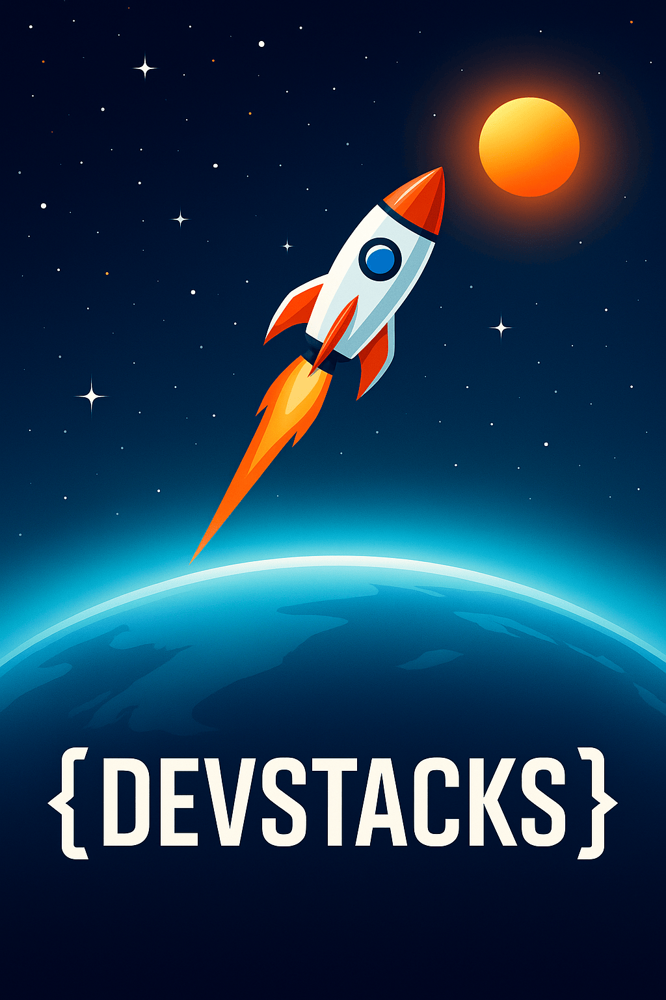

<p align="center">
  
</p>


# 🧠 DLangSDK by DevStacks

DLangSDK is the master SDK from DevStacks, bundling together six powerful programming stacks, each designed for a specific domain.

## 🔧 Included SDKs

| Stack Name         | Description                                     |
|--------------------|-------------------------------------------------|
| HobbyStackSDK      | For hobbyist languages: DPhx, DScala, DHask     |
| WebAppStackSDK     | Web frontend & full-stack: KScript, KTyped, etc |
| MobileStackSDK     | For Dart, Kotlin, Swift based compilers         |
| BackendStackSDK    | Java, Go, .NET languages for server-side dev     |
| SystemsStackSDK    | C, C++, Rust, Zig, Nim and system tools          |
| DataStackSDK       | Python, Julia, R, KLab and scientific languages |

Each stack includes prebuilt compilers renamed with the DevStacks branding.

## 🔌 How to Use

```bash
# On Linux
chmod +x dlang.sh
./dlang.sh

# On Windows
dlang.bat
